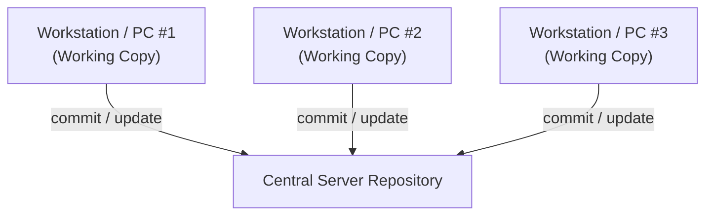
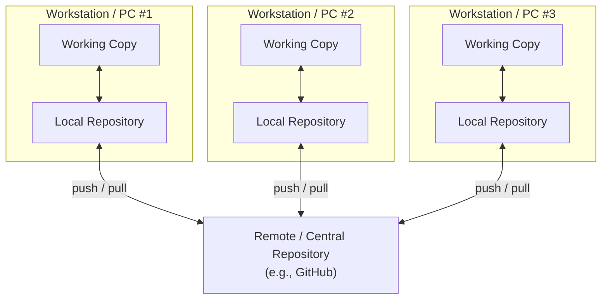
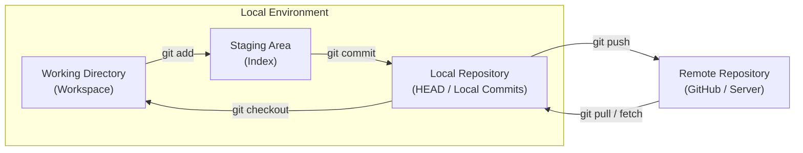
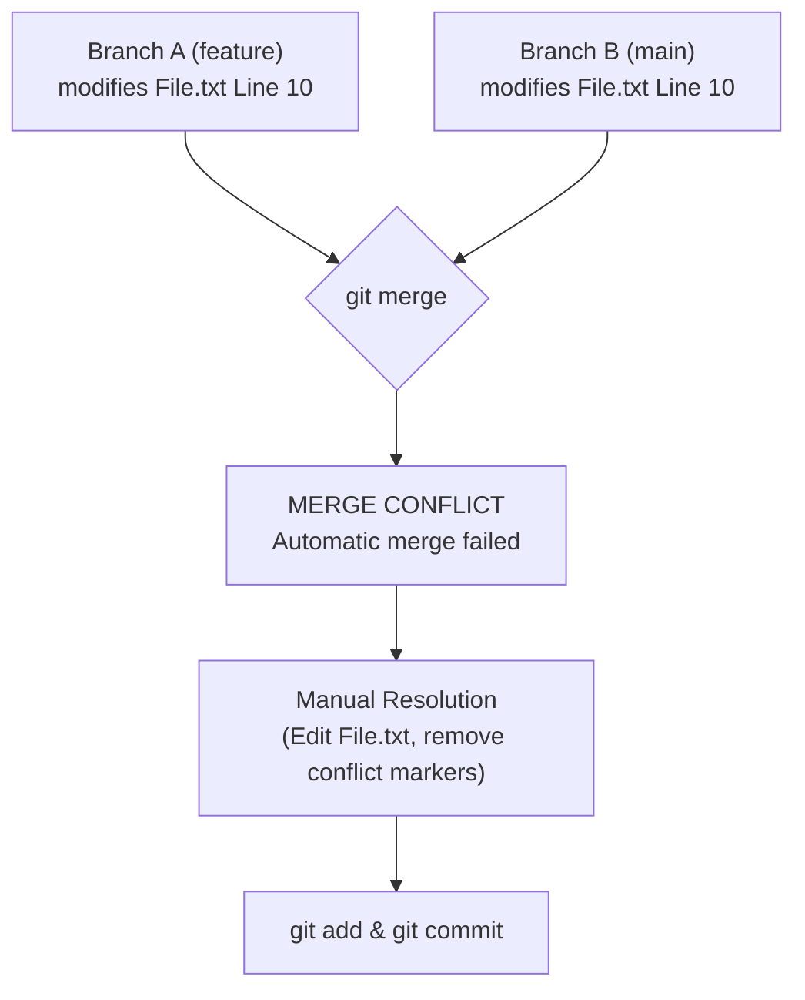

# Git & GitHub Short Notes for DevOps Engineers

*Author: Train With Shubham*

---

## 1. Source Code Management (SCM)

Source Code Management is crucial in modern software development and DevOps workflows. There are two main types of Version Control Systems:

### Centralized Version Control System (CVCS)

In a Centralized Version Control System, a single central server holds all the repository data, and workstations maintain only a working copy.



> **Note:**
> - Changes are not available locally without network connectivity. You must always be connected to the network to perform version control operations.
> - Single Point of Failure: If the central server fails, you risk losing the entire revision history and project data.

---

### Distributed Version Control System (DVCS)

In a Distributed Version Control System, every contributor maintains a full local copy ("clone") of the repository, including all files, commit history, and metadata.



> **Note:** 
> - Works offline and locally.
> - High redundancy and reliability since every clone acts as a full backup.

---

## 2. Why SCM Matters for DevOps Engineers

To run efficient **CI/CD pipelines**, you must always access the latest project updates:
* DevOps tools monitor source code repositories to trigger automated build, test, and release tasks.
* Release definitions deploy the latest compiled binaries to target environments (staging, production, client devices).

---

## 3. Git Architecture & Key Concepts



### Key Terms

* **Repository:** A project folder on a server or local machine storing code files, historical revisions, and metadata.
* **Working Directory:** The workspace where you physically view and modify files.
* **Commit:** Saves changes to the local repository.
* **Commit ID / Hash:** A unique 40-character alphanumeric checksum computed via SHA-1 algorithm. Even a single character or dot modification changes the Commit ID.
* **Tags:** Pointer attached to a specific commit to assign a meaningful version name (e.g., `v1.0.0`). Tags remain fixed even as new commits are added.
* **Snapshots:** Incremental state records captured at a given point in time (storing changes/deltas).
* **Push:** Operation to copy local repository commits to a remote central repository.
* **Pull:** Operation to fetch and merge changes from a remote repository into the local repository.

---

## 4. Git Branching

Branching allows parallel development without affecting the main source code.

* Default primary branch is traditionally `master` or `main`.
* Files created in a workspace are visible across branch workspaces until committed. Once committed, they belong to that specific branch.
* When creating a new branch, it inherits all history and data from the parent branch at the moment of creation.

### Common Branch Commands

```bash
# List all branches
git branch

# Create a new branch
git branch <branchname>

# Switch/Checkout to a branch
git checkout <branchname>
# Or using switch
git switch <branchname>

# Create and checkout to a new branch simultaneously
git checkout -b <branchname>

# Delete a branch
git branch -d <branchname>
```

---

## 5. Merge Conflicts & Resolution

Conflicts occur when the same file has different, overlapping modifications in two branches being merged.



### Steps to Resolve Conflicts
1. Identify conflicting files via `git status` or `git log --merge`.
2. Inspect differences using `git diff`.
3. Open files manually and select desired changes (resolving `<<<<<<<`, `=======`, `>>>>>>>` markers).
4. Stage resolved files using `git add <file>`.
5. Complete the merge process with `git commit`.

### Useful Commands for Conflict Management

| Command | Purpose |
| :--- | :--- |
| `git log --merge` | Show commits involved in the conflict |
| `git diff` | View precise line-by-line file differences |
| `git merge --abort` | Cancel the merge process and return to pre-merge state |
| `git reset --mixed` | Reset staging area while keeping working directory changes |

---

## 6. Basic & Essential Git Commands

### Configuration & Initialization

```bash
# Set global user credentials
git config --global user.name "Your Name"
git config --global user.email "your.email@example.com"

# Initialize a new local repository
git init

# Clone an existing repository
git clone <repository_url>
```

### File Operations &