# Docker for DevOps - Complete Notes from the Uploaded PDF

> **Scope:** These notes are based only on the uploaded 17-page Docker PDF. I have kept the topics, commands, examples, flow, and terminology from the PDF. Where the PDF itself is incomplete, cut off, or mislabeled, that is explicitly mentioned instead of adding outside material.

---

## 1. PDF Coverage Map

The PDF covers the following Docker topics:

1. Introduction & Purpose
2. Virtualization & Containerization
3. Build concept (`Build kya hota hai`)
4. Docker Terminologies
5. Docker Components - Hands-on
6. Projects Building using Docker
7. Docker Engine Architecture
8. Docker CLI
9. Docker Daemon (`dockerd`)
10. REST API
11. `containerd`
12. `runc`
13. Container
14. Docker installation/status verification
15. Docker group/user permission configuration
16. Docker Hub login using Personal Access Token
17. Dockerfile
18. Dockerfile instructions
19. `docker build`
20. Java Quotes Docker project
21. Port mapping and container naming
22. Platform compatibility build option
23. Container/image cleanup commands
24. Python Flask Docker project
25. Multi-stage Docker build
26. Distroless image
27. Docker Hub image tag/push
28. Docker Volumes
29. MySQL container and persistent storage
30. Docker Networking
31. Bridge, Host, None, Overlay, Macvlan network types
32. Two-tier Flask + MySQL Docker network task
33. Docker Compose / YAML file
34. `docker compose up`
35. `docker compose down`
36. Docker Scout - **listed in the PDF, but no explanation is provided**

---

# 2. Introduction & Purpose of Docker

## 2.1 What is introduced in the PDF?

The opening lecture slide is titled **Docker For DevOps** and starts with:

- Introduction & Purpose
- Virtualization & Containerization
- Build kya hota hai
- Docker Terminologies
- Docker Components (Hands-on)
- Projects Building using Docker

The lecture sketch also shows:

```text
Docker -> PaaS
2013
```

and uses Linux / Python / Windows sketches while introducing the Docker idea.

> The PDF does not contain a full written definition of Docker in this opening section; the explanation is mainly through lecture diagrams.

## 2.2 Purpose shown through the lecture flow

The basic flow developed through the PDF is:

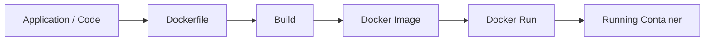

The PDF later reinforces this handwritten flow:

```text
Dockerfile --build--> image --run--> container
```

## 2.3 Code and build idea

A lecture sketch shows that source code must be **built** before it becomes a runnable application artifact.

Examples of build tools mentioned in the sketch:

- Maven
- npm
- pip

Conceptual flow from the PDF:

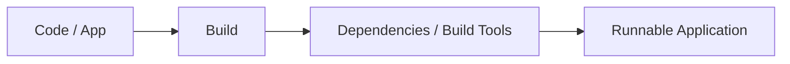

---

# 3. Virtualization vs Containerization

## 3.1 Virtualization

The PDF sketches virtualization with:

- Multiple VMs
- Hypervisor
- Host OS
- More resource usage
- VirtualBox reference

Architecture shown in the lecture:

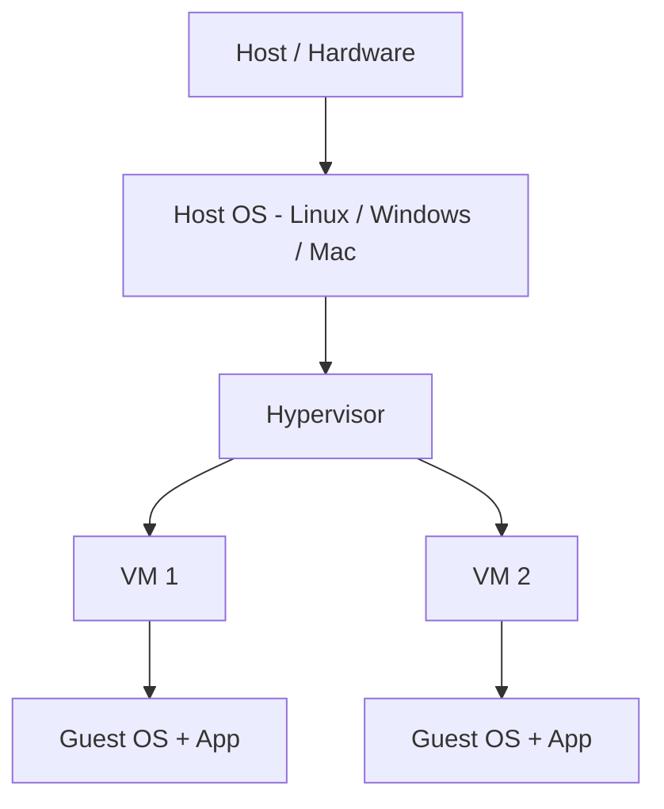

The handwritten comparison indicates virtualization uses **more resources**.

## 3.2 Containerization

The container side of the lecture shows:

- Docker container
- Shared host resources
- Lower cost/resource usage compared with the VM sketch

The PDF's container architecture sketch is essentially:

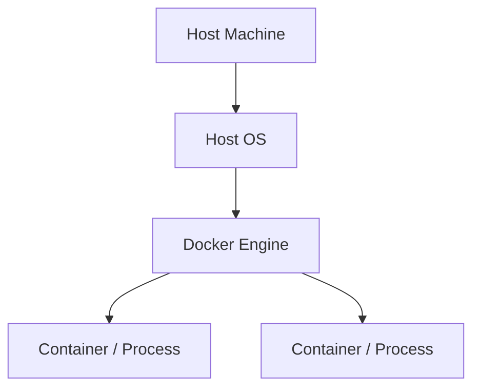

The PDF also includes a small App / Shell / Kernel sketch while discussing container internals.

---

# 4. Docker Architecture and Components

## 4.1 Docker Engine component flow shown in the PDF

The PDF shows this extended chain:

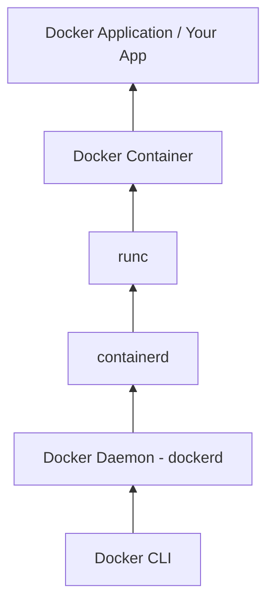

Another slide summarizes Docker Engine as **3 main components**:

1. Docker CLI
2. Docker Daemon (`dockerd`)
3. REST API

## 4.2 Docker CLI

**PDF definition:** The CLI is what you use to interact with Docker.

Examples shown:

```bash
docker run nginx
docker ps
docker stop container_id
```

Its job in the PDF:

- Take your command
- Send it to the Docker Daemon

The lecture analogy says to think of it as a **remote control**.

## 4.3 Docker Daemon (`dockerd`)

**PDF definition:** Main Docker service running in the background.

Responsibilities listed:

- Manage images
- Manage containers
- Manage networks
- Manage volumes
- Receive requests from Docker CLI

Example:

```bash
docker run nginx
```

The PDF explains that CLI sends the request to `dockerd`, and `dockerd` decides what actions need to happen.

Lecture analogy: **manager**.

## 4.4 REST API

The PDF describes REST API as:

> Communication layer between CLI and Daemon.

Architecture:

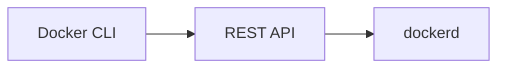

## 4.5 `containerd`

The PDF calls `containerd` a **container runtime manager used by Docker**.

Responsibilities listed:

- Pull images
- Create containers
- Start containers
- Stop containers
- Manage container lifecycle

Example used in the PDF:

```bash
docker run nginx
```

If the nginx image is not present, the PDF explains that `containerd` will download the nginx image and prepare the container.

Lecture analogy: **supervisor**.

## 4.6 `runc`

The PDF describes `runc` as a **lightweight tool that actually creates the container process**.

Responsibilities listed:

- Create namespaces
- Configure cgroups
- Start the container process

It provides:

- Process isolation
- Network isolation
- Resource limits

Lecture analogy: **worker that does the actual container creation**.

## 4.7 Container

The PDF defines a container as:

> A running instance of an image.

Example:

```bash
docker run nginx
```

Flow shown:

```text
nginx Image
    |
    v
nginx Container
```

The PDF says the container runs the nginx web server in an isolated environment.

Lecture analogy: **finished product**.

---

# 5. Docker Installation, Verification, and Linux Permission Setup

## 5.1 Commands shown in the PDF

```bash
systemctl status docker
sudo apt install docker.io -y
sudo apt update
sudo apt upgrade -y
docker --version
systemctl status docker
docker ps
cat /etc/group
```

## 5.2 Check Docker service

```bash
systemctl status docker
```

## 5.3 Install Docker package

```bash
sudo apt install docker.io -y
```

## 5.4 Update / upgrade packages

```bash
sudo apt update
sudo apt upgrade -y
```

## 5.5 Check Docker version

```bash
docker --version
```

## 5.6 Check running containers

```bash
docker ps
```

The PDF notes that if the current user cannot access Docker, check the `docker` group.

## 5.7 Check Linux groups

```bash
cat /etc/group
```

## 5.8 Check current user

```bash
whoami
```

## 5.9 Add current user to the Docker group

```bash
sudo usermod -aG docker $USER
```

The PDF explains `$USER` represents the currently logged-in user.

## 5.10 Re-enter / activate the Docker group

```bash
newgrp docker
```

The PDF labels this as **Log in to a new group**.

## 5.11 Permission setup flow

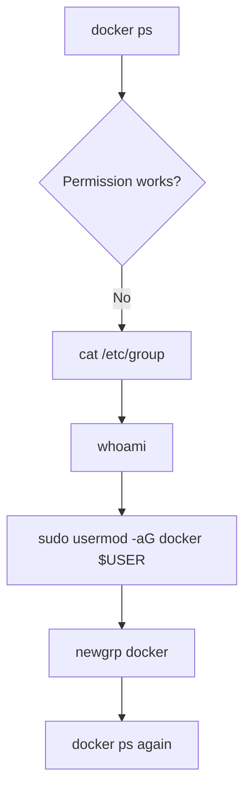

---

# 6. Basic Docker Run, Login, Stop, and Docker Hub Authentication

## 6.1 Ubuntu interactive container example

A terminal screenshot shows:

```bash
docker run -it ubuntu
```

## 6.2 Docker Hub login process shown in the PDF

The PDF steps are:

1. Open Docker Hub in browser.
2. Go to profile/settings.
3. Create a **Personal Access Token**.
4. Generate the token.
5. Copy the token and use it as the password while logging in from the terminal.

Example terminal command shown:

```bash
docker login -u jateen648
```

The screenshot then prompts for a password/token.

## 6.3 PDF's "Docker Logout" section

The PDF labels a section as **Docker Logout**, but the command displayed below it is:

```bash
docker stop a1b2c3d4e5f6
```

> **Source note:** This is exactly how it appears in the PDF. The PDF does not display a `docker logout` command in that section.

---

# 7. Dockerfile

## 7.1 Dockerfile definition from the PDF

> A Dockerfile is a text file that contains instructions to build a Docker image.

## 7.2 Example Dockerfile shown

```dockerfile
# Base image
FROM ubuntu:22.04

# Install packages
RUN apt-get update && apt-get install -y nginx

# Set working directory
WORKDIR /app

# Copy files from local machine
COPY . /app

# Expose a port
EXPOSE 80

# Command to run when container starts
CMD ["nginx", "-g", "daemon off;"]
```

## 7.3 Important Dockerfile instructions listed in the PDF

| Instruction | Meaning given in PDF |
|---|---|
| `FROM` | Base image |
| `RUN` | Execute commands during image build |
| `COPY` | Copy files into image |
| `ADD` | Copy files or download URLs |
| `WORKDIR` | Set working directory |
| `ENV` | Set environment variables |
| `EXPOSE` | Document container port |
| `CMD` | Default command when container starts |
| `ENTRYPOINT` | Main executable for the container |

## 7.4 Build an image from Dockerfile

```bash
docker build -t myapp .
```

Build flow:

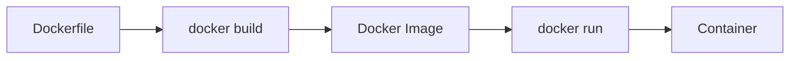

---

# 8. Java Quotes Docker Project

## 8.1 Project setup commands visible in the PDF

```bash
mkdir Project
ls
cd Project
```

The PDF then clones a GitHub Java Quotes repository. The complete repository URL is not fully legible in the PDF render, so it is represented here as:

```bash
git clone <java-quotes-repository-url>
```

More commands shown during project navigation/editing:

```bash
cd java-quotes-app
ls
cd src
ls
vim main.java
cat main.java
vim Dockerfile
cat Dockerfile
```

## 8.2 Java Quotes Dockerfile shown in the PDF

```dockerfile
# 1. Base Image(OS)
# Name : Version Simple Tag
FROM openjdk:17-jdk-alpine

# 2. working directory for the app
WORKDIR /app

# 3. code from your host to your container (working dir)
COPY src/Main.java /app/Main.java
COPY quotes.txt /app/quotes.txt

# 4. Run the commands to install libs or to compile code
RUN javac Main.java

# 5. Expose the port
EXPOSE 8000

# 6. serve the app / Keep it running
CMD ["java","Main"]
```

## 8.3 `docker build` core syntax shown

```bash
docker build [OPTIONS] PATH | URL | -
```

### Build current directory

```bash
docker build .
```

### Tag image with a name

```bash
docker build -t my-image-name .
```

### Tag image with name and version

```bash
docker build -t my-image-name:1.0 .
```

### Use a specific Dockerfile

```bash
docker build -f /path/to/Dockerfile .
```

## 8.4 Actual Java project build

```bash
docker build -t java-quotes:latest .
```

## 8.5 List images

```bash
docker images
```

## 8.6 Run Java Quotes container

```bash
docker run -d -p 8000:8000 --name Java-Quotes-app java-quotes:latest
```

Options demonstrated:

- `-d` - detached/background mode
- `-p 8000:8000` - port mapping
- `--name Java-Quotes-app` - container name
- `java-quotes:latest` - image/tag

---

# 9. Compatibility Build and Cleanup Commands

## 9.1 Platform compatibility command shown

The PDF has a section titled **Competitible issue fix** and shows a build command using a platform option:

```bash
docker build -t java-app:latest . --platform=linux/amd64
```

## 9.2 Remove containers by ID

The PDF shows examples such as:

```bash
docker rm 75d032008184
docker rm 8348d996850c
```

Generic form:

```bash
docker rm <container_id>
```

## 9.3 Docker system prune

```bash
docker system prune
```

The screenshot warns that it removes items such as:

- stopped containers
- networks not used by at least one container
- dangling images
- unused build cache

---

# 10. Python Flask Docker Project

The PDF shows another Dockerfile project:

```dockerfile
# Base image (OS)
FROM python:3.14-slim

# working directory
WORKDIR /app

# copy src code to container
COPY . .

# run the build commands
RUN pip install -r requirements.txt

# Expose port 80
EXPOSE 80

# serve the app / run the app (keep it running)
CMD ["python","run.py"]
```

The PDF then transitions from basic Docker topics to the advanced/practical items:

- Multi-stage Docker builds / Distroless images
- Docker Hub (Push / tag / pull)
- Docker Volumes (storage MySQL)
- Docker Networking (2-tier application with Database)
- Docker Compose
- Docker Scout

---

# 11. Multi-stage Docker Build and Distroless Image

## 11.1 Multi-stage Dockerfile shown in the PDF

```dockerfile
# Stage 1 - slim image with Linux distribution
FROM python:3.9-slim AS builder

WORKDIR /app

COPY . .

RUN pip install -r requirements.txt --target=/app/deps

# Stage 2
FROM gcr.io/distroless/python3-debian12

WORKDIR /app

COPY --from=builder /app/deps /app/deps
COPY --from=builder /app .

ENV PYTHONPATH="/app/deps"

EXPOSE 80

CMD ["python","run.py"]
```

## 11.2 Multi-stage flow

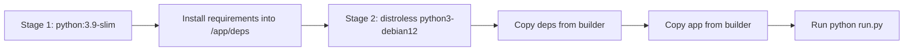

## 11.3 Build using alternate Dockerfile

```bash
docker build -f Docker-multi -t python-app-mini .
```

## 11.4 Run built image

```bash
docker run -p 80:80 python-app-mini:latest
```

---

# 12. Interview Cleanup Commands from the PDF

The PDF contains an interview question:

> Remove all Docker images and Docker containers without using `docker system` tools.

Commands shown:

## 12.1 Get all container IDs

```bash
docker ps -aq
```

## 12.2 Remove all containers returned by the command

```bash
docker rm $(docker ps -aq)
```

The PDF notes that `$()` is used to run a Linux command internally/substitute its output.

## 12.3 Get all image IDs

```bash
docker images -aq
```

## 12.4 Remove all images returned by the command

```bash
docker rmi $(docker images -aq)
```

---

# 13. Docker Hub - Tag and Push Image

The PDF section is titled **How to Store the image on the Docker Hub**.

## 13.1 Login

```bash
docker login
```

## 13.2 Initial push attempt

```bash
docker push python-app-mini:latest
```

The PDF shows a push access denied / insufficient scope error because the image was not yet tagged with the Docker Hub namespace.

## 13.3 Docker info - optional

```bash
docker info
```

## 13.4 Tag the image with Docker Hub username

PDF example:

```bash
docker image tag python-app-mini:latest jateen648/python-app-mini:latest
```

## 13.5 List images after tagging

```bash
docker images
```

## 13.6 Push namespaced image

```bash
docker push jateen648/python-app-mini:latest
```

## 13.7 Docker Hub push flow

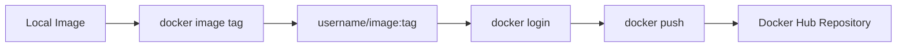

---

# 14. Docker Volumes - MySQL and Persistent Storage

## 14.1 MySQL container commands shown

```bash
docker run mysql:latest
```

```bash
docker run -d -e MYSQL_ROOT_PASSWORD=ROOT mysql:latest
```

```bash
docker ps
```

```bash
docker exec -it container_ID bash
```

Inside the container:

```bash
mysql -u root -p
```

MySQL command shown:

```sql
show databases;
```

The PDF indicates the password in this example is `ROOT`.

To exit:

```bash
EXIT
```

## 14.2 Stop and remove a container

PDF example:

```bash
docker stop cabdc9b046ab && docker rm cabdc9b046ab
```

## 14.3 Docker Volume definition from the PDF

> A Docker volume is a storage mechanism used to persist data outside a container.

The PDF says that normally data stored inside a container is lost when the container is removed, while volumes allow data to remain even if the container is:

- stopped
- deleted
- recreated

### Why use Docker volumes?

The PDF lists:

- Persist application data
- Share data between containers
- Store database files safely
- Backup and restore data easily

## 14.4 Create a volume

```bash
docker volume create myvolume
```

## 14.5 List volumes

```bash
docker volume ls
```

## 14.6 Inspect a volume

```bash
docker volume inspect myvolume
```

## 14.7 Use a volume with a container

```bash
docker run -d \
  --name mycontainer \
  -v myvolume:/app/data \
  nginx
```

The PDF explains:

```text
myvolume = Docker-managed volume
/app/data = path inside the container
```

## 14.8 MySQL volume example

```bash
docker run -d \
  --name mysql-db \
  -e MYSQL_ROOT_PASSWORD=password \
  -v mysql_data:/var/lib/mysql \
  mysql
```

## 14.9 Volume concept diagram

```mermaid
flowchart LR
    C[Container] --> P[/app/data or /var/lib/mysql]
    P <--> V[(Docker Volume)]
    C -. container removed .-> X[Container disappears]
    V --> S[Data remains in volume]
```

## 14.10 Volume demonstration commands visible in the PDF

The next page demonstrates files inside/outside a container using commands such as:

```bash
ls
cd ..
cd volumes/
ls
touch this_is_outside_container.txt
ls
docker ps
docker exec -it 67d4debd6b5b bash
cd db
ls
```

The terminal output shows both:

```text
this_is_inside_container.txt
this_is_outside_container.txt
```

inside the mapped location, demonstrating the volume mapping exercise.

---

# 15. Docker Networking

## 15.1 Docker Network definition from the PDF

The PDF says Docker Network is a communication system that allows Docker containers to communicate with:

1. Other containers
2. Docker host machine
3. External networks / Internet

It also states that when a Docker container is created, Docker attaches it to a network so it can send and receive data.

## 15.2 Communication example shown

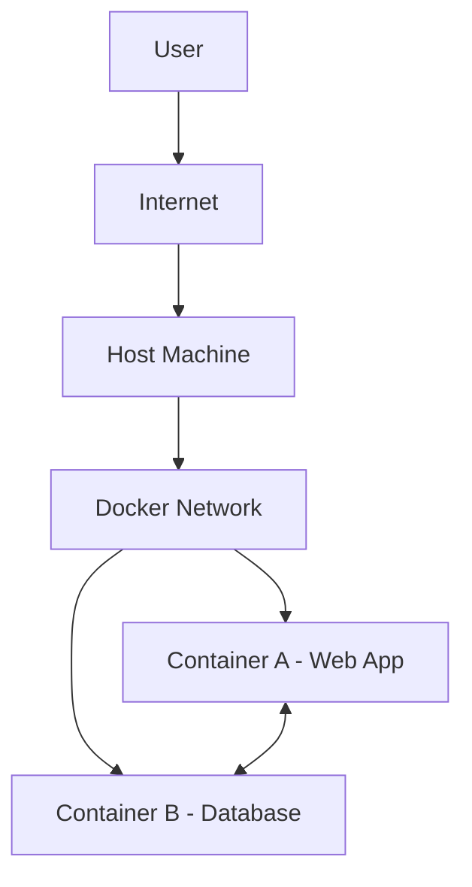

The PDF explicitly states that Container A can communicate with Container B using Docker networking.

## 15.3 Tier sketch from the lecture

The handwritten lecture page lists tiers:

1. Presentation - Frontend
2. Logical / Business Tier - Backend
3. Database Tier - Database

A later sketch uses **Flask App + MySQL Database** as a two-tier example.

---

# 16. Types of Docker Networks

The PDF lists **5 types of network drivers**:

1. Bridge Network
2. Host Network
3. None Network
4. Overlay Network
5. Macvlan Network

## 16.1 Bridge Network - Default Network

The PDF states:

- Bridge is the default Docker network when a container is created without specifying a network.
- It creates a private internal network on the Docker host.
- Containers connected to the same bridge network can communicate with each other.

## 16.2 Host Network

The PDF states:

> In Host networking, the container directly uses the network of the host machine.

## 16.3 None Network

The PDF states that the container gets **no network access**.

It has:

- No IP
- No Internet
- No communication

## 16.4 Overlay Network

The PDF states:

> Overlay networking connects containers running on different Docker hosts.

## 16.5 Macvlan Network

The visible PDF line says:

> Macvlan assigns a container its own:

The page ends at this point, so the PDF does **not** provide the remainder of this explanation.

---

# 17. Two-Tier Docker Network Task - Flask + MySQL

## 17.1 Architecture shown in the PDF

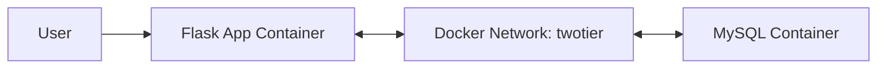

## 17.2 Create two-tier network

```bash
docker network create twotier
```

The PDF prints the generated network ID after this command.

## 17.3 List Docker networks

```bash
docker network ls
```

The example output includes:

- `bridge`
- `host`
- `none`
- `twotier` using the `bridge` driver

## 17.4 Inspect the network / network ID

PDF example:

```bash
docker inspect f0b797aa2385
```

Later the PDF also uses:

```bash
docker inspect twotier
```

## 17.5 Run MySQL container on the `twotier` network

```bash
docker run -d --name mysql2 \
  -v mysql_data:/var/lib/mysql \
  --network=twotier \
  -e MYSQL_ROOT_PASSWORD=admin \
  -e MYSQL_DATABASE=tws_db \
  -e MYSQL_USER=admin \
  -e MYSQL_PASSWORD=admin \
  -p 3306:3306 \
  mysql:latest
```

## 17.6 Run Flask image as a container on the same network

A short command shown in the PDF:

```bash
docker run -d -p 5000:5000 --network=twotier flask-app:latest
```

A more complete command shown immediately below:

```bash
docker run -d --name flask-app \
  -p 5000:5000 \
  --network=twotier \
  -e MYSQL_HOST=mysql2 \
  -e MYSQL_USER=admin \
  -e MYSQL_PASSWORD=admin \
  -e MYSQL_DB=tws_db \
  flask-app:latest
```

## 17.7 Verify / troubleshoot commands

```bash
docker ps
```

```bash
docker logs id
```

```bash
docker inspect twotier
```

## 17.8 Enter the running container

PDF example:

```bash
docker exec -it 22987f37eb5b bash
```

---

# 18. Docker Compose / YAML File

## 18.1 Definition from the PDF

The PDF states:

> A Docker YAML file (officially called `compose.yaml`, but also commonly known as `docker-compose.yml`) is a configuration file used by Docker Compose to define and run multi-container applications.

## 18.2 Create/edit compose file

```bash
vim docker-compose.yml
```

## 18.3 YAML example shown in the PDF

```yaml
services:
  web:
    image: nginx:alpine
    container_name: web_server
    ports:
      - "8080:80"
    volumes:
      - ./html:/usr/share/nginx/html
    networks:
      - app-network
    restart: always

  database:
    image: postgres:15-alpine
    container_name: db_server
    environment:
      POSTGRES_USER: admin
      POSTGRES_PASSWORD: supersecretpassword
    volumes:
      - db-data:/var/lib/postgresql/data
    networks:
      - app-network

volumes:
  db-data:

networks:
  app-network:
```

## 18.4 Compose architecture represented by the YAML

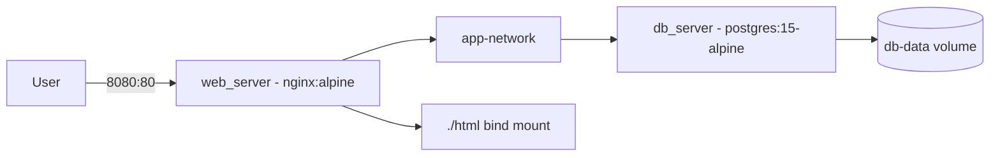

## 18.5 Start the multi-container application

```bash
docker compose up
```

## 18.6 Stop the multi-container application

```bash
docker compose down
```

---

# 19. Docker Scout

`Docker Scout` appears in the PDF's advanced topic list.

> **Important:** No command, definition, or hands-on Docker Scout explanation is included in the visible PDF pages, so no extra Docker Scout material has been added here.

---

# 20. Complete Command Cheat Sheet from the PDF

## Docker service / installation

```bash
systemctl status docker
sudo apt install docker.io -y
sudo apt update
sudo apt upgrade -y
docker --version
```

## User / group permissions

```bash
docker ps
cat /etc/group
whoami
sudo usermod -aG docker $USER
newgrp docker
```

## Basic run / stop

```bash
docker run nginx
docker run -it ubuntu
docker ps
docker stop container_id
docker stop a1b2c3d4e5f6
```

## Docker Hub login

```bash
docker login
docker login -u jateen648
docker info
```

## Dockerfile build

```bash
docker build -t myapp .
docker build [OPTIONS] PATH | URL | -
docker build .
docker build -t my-image-name .
docker build -t my-image-name:1.0 .
docker build -f /path/to/Dockerfile .
```

## Java Quotes project

```bash
mkdir Project
ls
cd Project
git clone <java-quotes-repository-url>
cd java-quotes-app
ls
cd src
ls
vim main.java
cat main.java
vim Dockerfile
cat Dockerfile
docker build -t java-quotes:latest .
docker images
docker run -d -p 8000:8000 --name Java-Quotes-app java-quotes:latest
```

## Platform build / cleanup

```bash
docker build -t java-app:latest . --platform=linux/amd64
docker rm <container_id>
docker system prune
```

## Multi-stage / distroless project

```bash
docker build -f Docker-multi -t python-app-mini .
docker run -p 80:80 python-app-mini:latest
```

## Interview cleanup

```bash
docker ps -aq
docker rm $(docker ps -aq)
docker images -aq
docker rmi $(docker images -aq)
```

## Docker Hub image tag / push

```bash
docker login
docker push python-app-mini:latest
docker info
docker image tag python-app-mini:latest jateen648/python-app-mini:latest
docker images
docker push jateen648/python-app-mini:latest
```

## MySQL / volumes

```bash
docker run mysql:latest
docker run -d -e MYSQL_ROOT_PASSWORD=ROOT mysql:latest
docker ps
docker exec -it container_ID bash
mysql -u root -p
```

```sql
show databases;
```

```bash
EXIT
docker stop cabdc9b046ab && docker rm cabdc9b046ab
docker volume create myvolume
docker volume ls
docker volume inspect myvolume
```

```bash
docker run -d \
  --name mycontainer \
  -v myvolume:/app/data \
  nginx
```

```bash
docker run -d \
  --name mysql-db \
  -e MYSQL_ROOT_PASSWORD=password \
  -v mysql_data:/var/lib/mysql \
  mysql
```

## Volume lab commands

```bash
ls
cd ..
cd volumes/
ls
touch this_is_outside_container.txt
ls
docker ps
docker exec -it 67d4debd6b5b bash
cd db
ls
```

## Networking / two-tier

```bash
docker network create twotier
docker network ls
docker inspect f0b797aa2385
```

```bash
docker run -d --name mysql2 \
  -v mysql_data:/var/lib/mysql \
  --network=twotier \
  -e MYSQL_ROOT_PASSWORD=admin \
  -e MYSQL_DATABASE=tws_db \
  -e MYSQL_USER=admin \
  -e MYSQL_PASSWORD=admin \
  -p 3306:3306 \
  mysql:latest
```

```bash
docker run -d -p 5000:5000 --network=twotier flask-app:latest
```

```bash
docker run -d --name flask-app \
  -p 5000:5000 \
  --network=twotier \
  -e MYSQL_HOST=mysql2 \
  -e MYSQL_USER=admin \
  -e MYSQL_PASSWORD=admin \
  -e MYSQL_DB=tws_db \
  flask-app:latest
```

```bash
docker ps
docker logs id
docker inspect twotier
docker exec -it 22987f37eb5b bash
```

## Docker Compose

```bash
vim docker-compose.yml
docker compose up
docker compose down
```

---

# 21. End-to-End Revision Flow

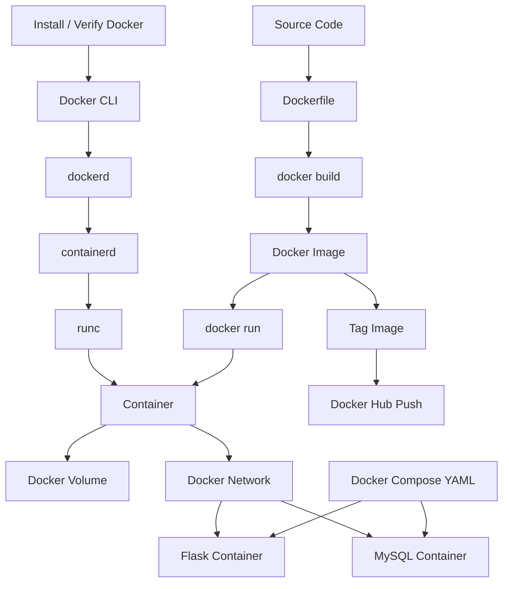

---

# 22. What You Have Covered from This PDF

By the end of the PDF, the learning path is:

```text
Docker Intro
    -> Virtualization vs Containerization
    -> Docker Architecture
    -> CLI / dockerd / REST API / containerd / runc
    -> Docker installation and Linux permissions
    -> Images and Containers
    -> Dockerfile
    -> Build
    -> Run and Port Mapping
    -> Java Project
    -> Python Flask Project
    -> Multi-stage Build
    -> Distroless Image
    -> Cleanup Commands
    -> Docker Hub Tag / Push
    -> MySQL Container
    -> Volumes
    -> Networking
    -> Network Types
    -> Two-tier Flask + MySQL
    -> Docker Compose / YAML
```

---

## Source Completeness Notes

- **Docker Scout** is only listed, not explained.
- **Macvlan** explanation is cut off after "Macvlan assigns a container its own:".
- The PDF labels one section **Docker Logout**, but displays `docker stop a1b2c3d4e5f6` instead of a logout command.
- The Java repository URL in the screenshot is not fully legible, so it is represented as `<java-quotes-repository-url>` instead of guessing the missing text.

